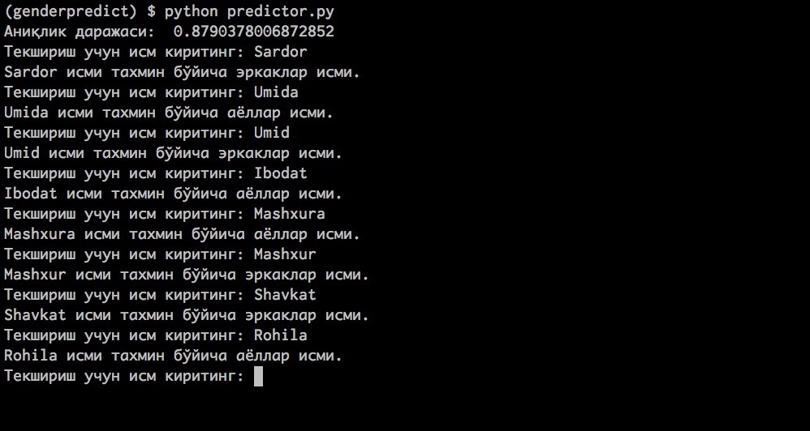

# Исм бўйича жинсни тахмин қилиш
Ўзбек исмлари бўйича жинсни ўйлаб топиш амалий иши. Лойиҳа «машинавий таълим» (machine learning) бўйича олинган билимни мустаҳкамлаш мақсадида яратилди.

## Лойиҳада қўлланилган машинавий таълимнинг баъзи услублари
* Наив байес таснифловчиси (Naive Bayes classifier)
* Эҳтимолликлар тақсимланиши (Probability Distribution)

Лойиҳа 2 муҳитга бўлинган:

1. Frontend (фойдаланувчи интерфейси)

2. Backend API (амалий дастурлаш интерфейси)

## Лойиҳани локал муҳитга тайёрлаб олиш

### Frontend учун йўриқнома

#### Талаблар
* Node.js > 6.0
* Vue.js >= 2.0

#### Буйруқлар

```bash
  $ cd frontend
  $ brew install yarn
  $ yarn
  $ yarn run build
```

### Backend учун йўриқнома

#### Талаблар
* Python >= 3.5
* NLTK >= 3.2
* Scrapy >= 1.3
* Sanic >= 0.1.9

#### Буйруқлар

```bash
  $ cd backend
  $ pip install -r requirements.txt
  $ python3 -m sanic server.app --host=0.0.0.0 --port=8888 --workers=4
```
